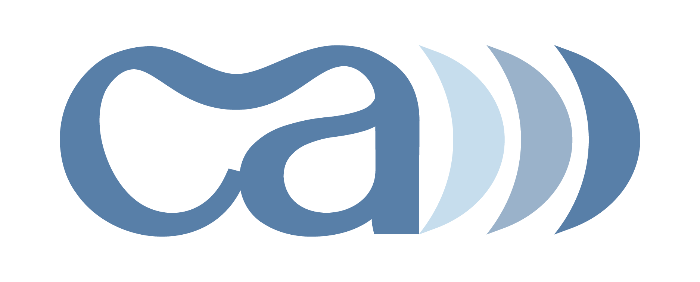

¡Bienvenidx a mi portafolio digital! Aquí podrás encontrar una colección de mis proyectos más destacados en diseño UX/UI,
desarrollo web, marketing digital y comercio electrónico. Este portafolio está diseñado para mostrar mi experiencia, 
habilidades y enfoque detallado e innovador en el mundo digital.

## Sobre mí

Soy Alex Castañeda, ingenierx en sistemas ambientales con formación en Diseño UX/UI y Desarrollo Web. 
Con más de 5 años de experiencia en Comercio Electrónico y Marketing Digital, me dedico a optimizar la presencia digital de las empresas, 
mejorar la experiencia de usuario y aumentar la eficiencia y satisfacción de los usuarios en las empresas.

## Proyectos Destacados
1. ## Rainbow Play Cafe
   - *Descripción:*
     Rainbow Play Café es un área de juego y cafetería donde los pequeñines pueden comenzar a desarrollar habilidades motoras y sociales.
     También brinda una oportunidad para que los padres entablen relaciones con otros padres del área que comparten intereses similares.
     Xanat Guiot, CEO de Rainbow Play Café, llegó con una solicitud específica: "Quiero un sitio web nuevo que fomente la reservación de
     horarios de juego para evitar aglomeraciones y mejorar la experiencia de los clientes en el playground."
    - *Tecnologías utilizadas:*
      
      
      
      
2. ## GCSS
   - *Descripción:*
     GCSS es una empresa familiar dedicada a la venta, distribución, mantenimiento y reparación de equipos de seguridad especializados en
     prevención de pérdidas. Gerardo Castañeda, CEO de GCSS, nos contactó para iniciar su presencia digital. Buscaban una plataforma en línea
     donde los clientes pudieran familiarizarse con los sistemas de prevención de pérdidas y los servicios especializados que ofrecen.
    - *Tecnologías utilizadas:*
      
      
      
      
      
      

## Habilidades técnicas
- **Diseño UX/UI:** Herramientas y técnicas de diseño.
- **Desarrollo Frontend:** HTML, CSS, JavaScript, Bootstrap.
- **Marketing Digital:** SEO, SEM, campañas en redes sociales.
- **Optimización de Conversión:** Análisis de datos, A/B testing.
- **Investigación de Usuario:** Entrevistas, encuestas, pruebas de usabilidad.

## Contáctame
Si estás interesadx en colaborar o tienes alguna pregunta, no dudes en contactarme.
- *Correo electrónico:* [contacto@casha.mx](mailto:contacto@casha.mx)
- **LinkedIn:** [Perfil de LinkedIn](https://www.linkedin.com/in/alexcasha/)
- **Sitio web:** [casha.mx](https://casha.mx)

¡Estoy emocionadx por la oportunidad de colaborar en tu proyecto digital!

